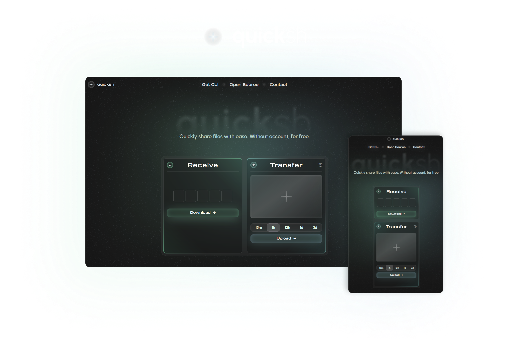
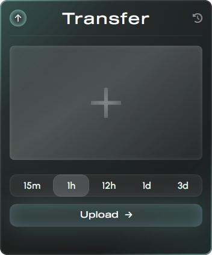
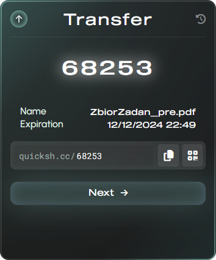

    

    <h2>✨ Overview</h2>

[quicksh.cc](https://quicksh.cc) is a **files sharing platform**. The main goal is to transfer files **as quickly as possible**. __No account, no ads, no popups or unnecessary clicks__.

    <h2>👁️ Usage</h2>

### ⬆️ Transfering

    

1. Press the big "+" button on the transfer card and choose file.

2. Select availability period from: `15 minutes`, `1 hour`, `12 hours`, `1 day` or `3 days`.

3. Press the "upload" button to transfer file to the server.

### 🔗 Sharing

    

