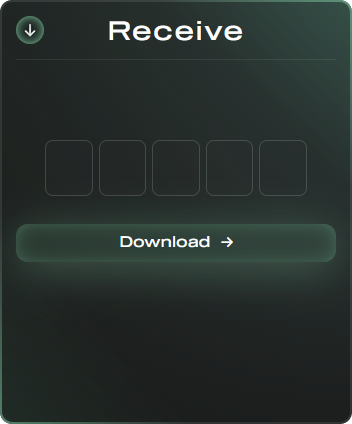

    

    <h2>✨ Overview</h2>

[quicksh.cc](https://quicksh.cc) is a **files sharing platform**. The main goal is to transfer files **as quickly as possible**. __No account, no ads, no popups or unnecessary clicks__.

    <h2>👁️ Usage</h2>

### ⬆️ Transfering

    

1. Press the big "+" button on the transfer card and choose file.

2. Select availability period from: `15 minutes`, `1 hour`, `12 hours`, `1 day` or `3 days`.

3. Press the "upload" button to transfer file to the server.

 
### 🔗 Sharing

    

After uploading a file, card will display the transfer information including:
  - Transfer code (📋 click to copy)
  - File's name
  - Expiration date
  - Share URL (with QR code)

 
### 📜 History

    

You can access the transfers history by pressing **button in the top-right corner**. You will see the popup presented in the image above.

Here, You can see each transfer's `code`, `name` and `expire date`. You can also **🗑️ manually remove** the transfer before expiration.

 
### 📦 Receiving

    

If You have the full transfer URL (like `quicksh.cc/00000`) or a QR code, simply open the site and code will automatically be pasted into the input field. Otherwise, manually type all the digits into fields. Press the **download** button. If transfer's code is correct and the file is not expired, downloading will start.

