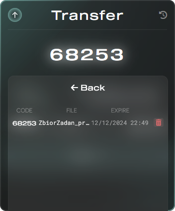

<div align="center">
    
</div>

<div align="center">
    <h2>✨ Overview</h2>
</div>

[quicksh.cc](https://quicksh.cc) is a **files sharing platform**. The main goal is to transfer files **as quickly as possible**. __No account, no ads, no popups or unnecessary clicks__.

<div align="center">
    <h2>👁️ Usage</h2>
</div>

### ⬆️ Transfering

<div align="center">
    
</div>

1. Press the big "+" button on the transfer card and choose file.

2. Select availability period from: `15 minutes`, `1 hour`, `12 hours`, `1 day` or `3 days`.

3. Press the "upload" button to transfer file to the server.

##### Note: You can have up to 5 active transfers at once. (Checked by IP)

<br>

### 🔗 Sharing

<div align="center">
    
</div>

After uploading a file, card will display the transfer information including:
  - Transfer code (📋 click to copy)
  - File's name
  - Expiration date
  - Share URL (with QR code)

<br>

### 📜 History

<div align="center">
    
</div>

You can access the transfers history by pressing **button in the top-right corner**. You will see the popup presented in the image above.

Here, You can see each transfer's `code`, `name` and `expire date`. You can also **🗑️ manually remove** the transfer before expiration.

<br>

### 📦 Receiving

<div align="center">
    
</div>

If You have the full transfer URL (like `quicksh.cc/00000`) or a QR code, simply open the site and code will automatically be pasted into the input field. Otherwise, manually type all the digits into fields. Press the **download** button. If transfer's code is correct and the file is not expired, downloading will start.

<div align="center">
    <h2>🎯 API Endpoints</h2>
</div>

### Current API url: [quicksh.cc/api](https://quicksh.cc/api/)

##### 🗨️ Response format.

All endpoints (except `receive`) respond with the `JSON` format message. Every message has a boolean `status` field which indicates the action status. If the `status` is `false`, there will be also a `error` field with the error information.

Alongside the `status` field, You can also validate the response's `status code`. It will be either `200` for successful requests or `400` for failed. Spamming requests will result with the `429` (rate limited) response.

#### 🎯 **POST** `/transfer/`

```
Transfer new file to the platform.
```

Request body format:

- `file`: contains the file stream.
- `expire`: availability time period:
  * `0` - 15 minutes
  * `1` - 1 hour
  * `2` - 12 hours
  * `3` - 1 day
  * `4` - 3 days

Successful response format:

```json
{
    "status": true,
    "code": 12345,
    "expire": "dd/mm/YYYY hh:mm"
}
```

#### 🎯 **GET** `/receive/{code}`

```
Download a shared file.
```

Replace the `{code}` with the actual code integer within `[10000, 99999]` range.

If code is valid, server will respond with the file stream, otherwise with the standard JSON error message. *(tip: distinguish by the `status code`)*

#### 🎯 **DELETE** `/delete/{code}`

```
Delete owned shared file. Caller's IP must match the uploader's IP.
```

Replace the `{code}` with the actual code integer within `[10000, 99999]` range.

The `status` field in the server response will indicate wheter the deletion was succesful.

#### 🎯 **GET** `/owned-codes`

```
Gather all available transfered files. (Used for the history.)
Response is based on the caller's IP address.
```

Successful response format:

```json
{
    "status": true,
    "response": {
        "11111": {
            "file": "filename.txt",
            "expire": "dd/mm/YYYY hh:mm"
        },

        "22222": {
            "file": "other file.txt",
            "expire": "dd/mm/YYYY hh:mm"
        },
    }
}
```


